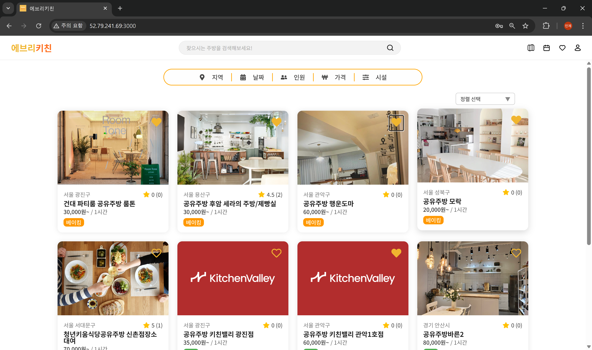
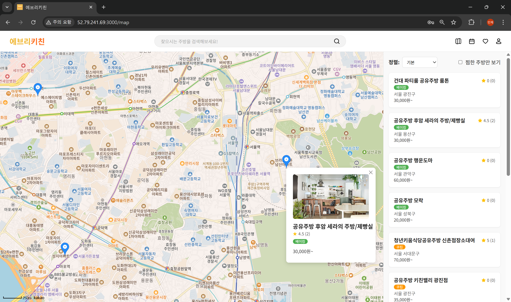
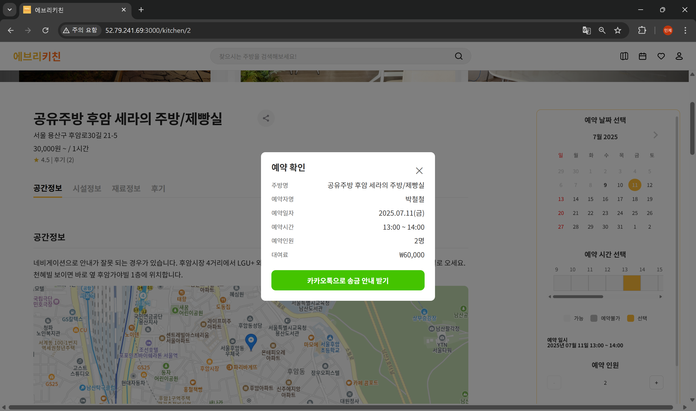
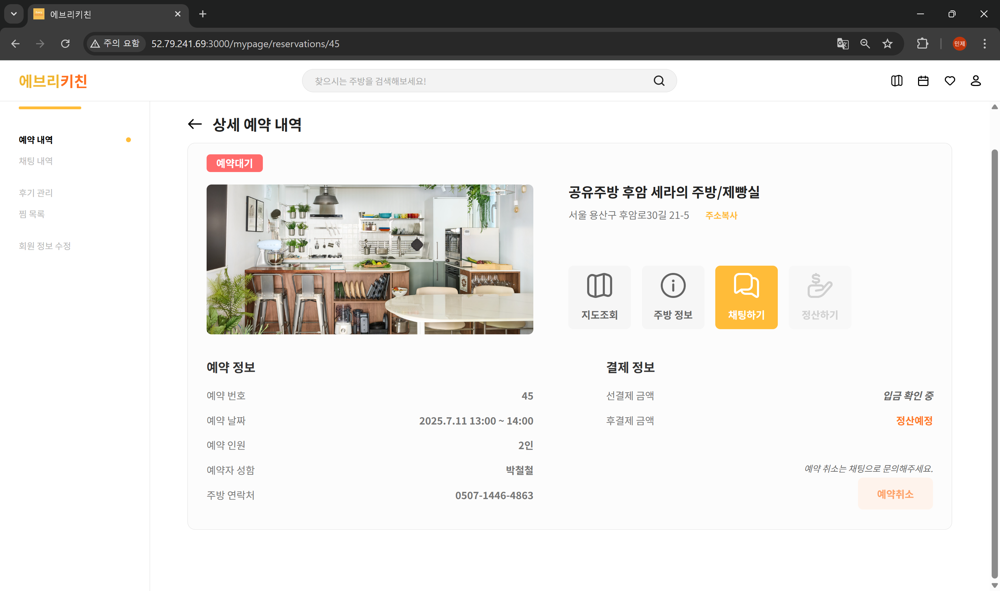
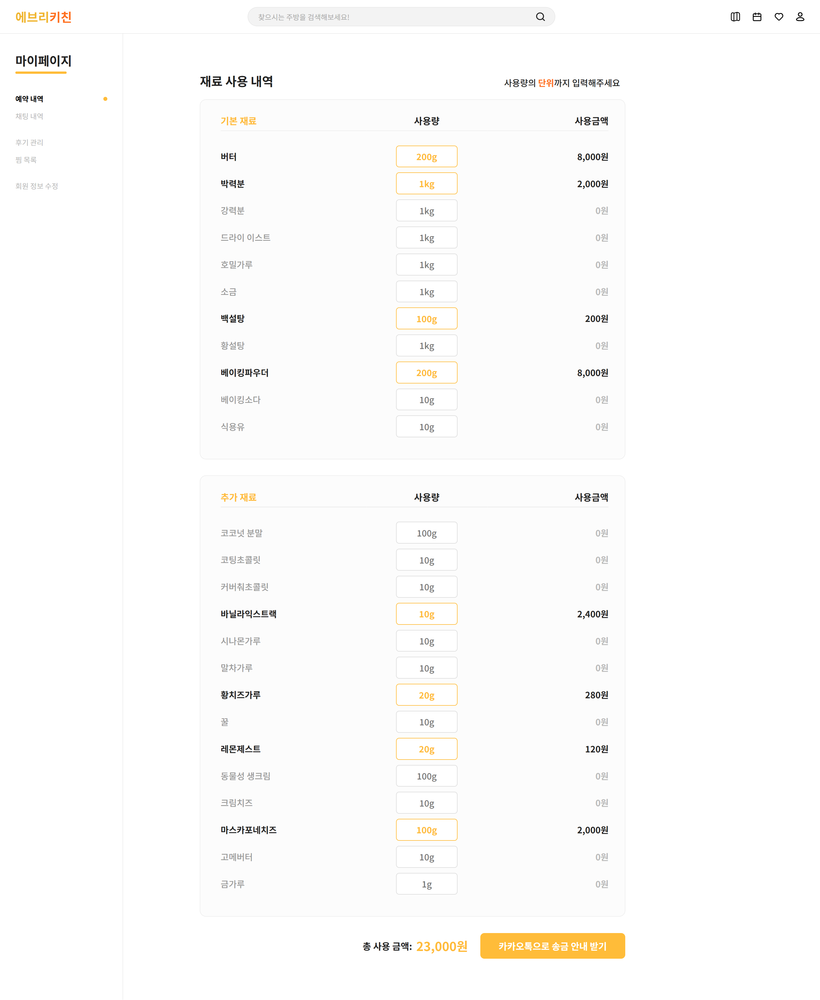
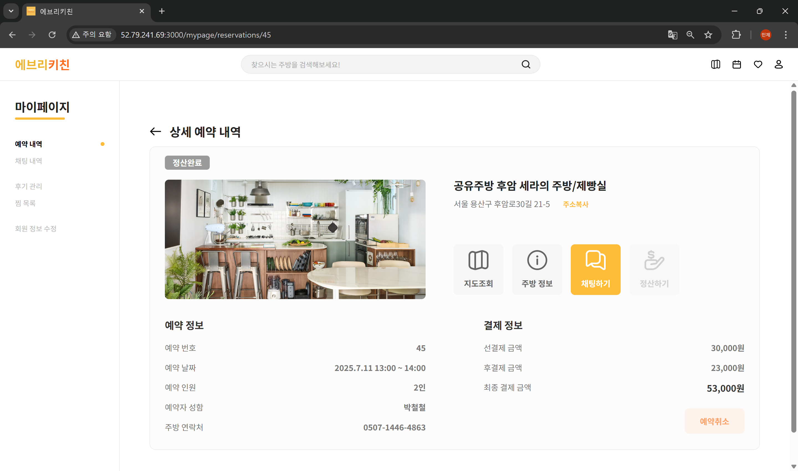
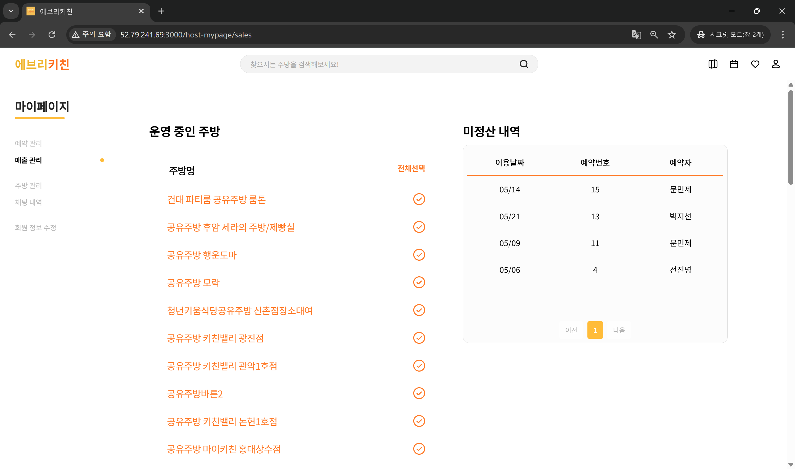
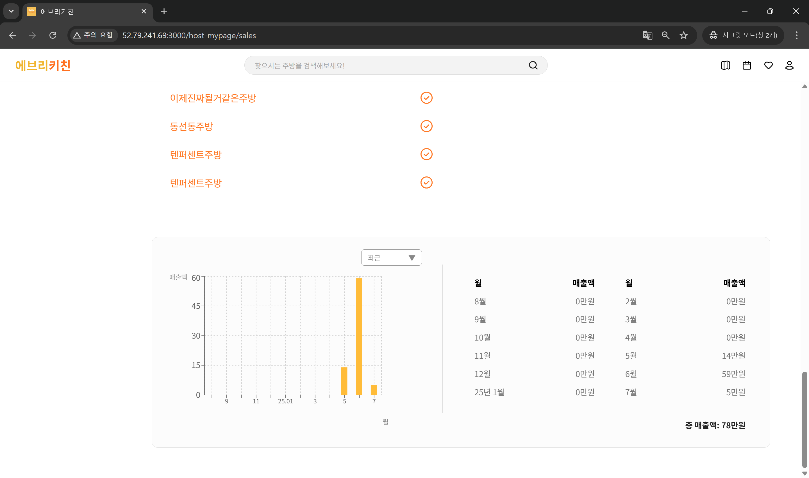
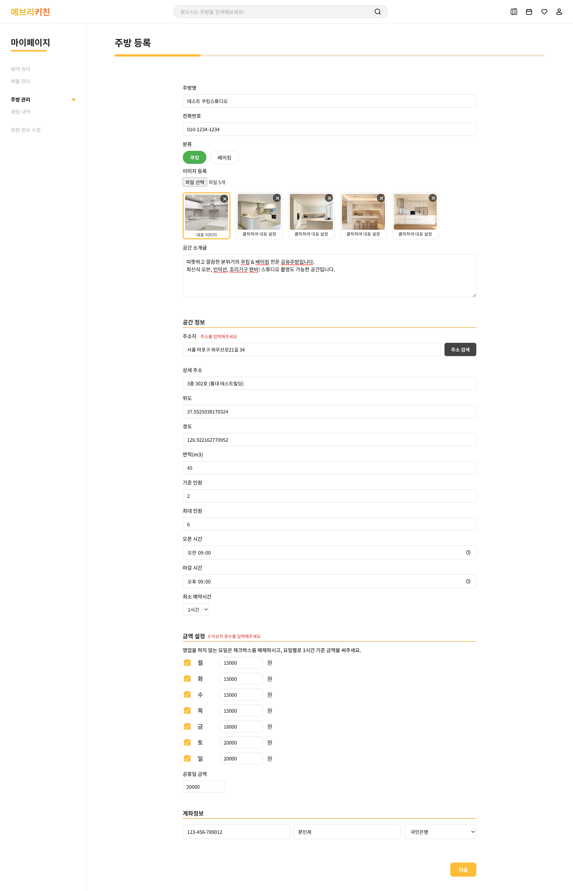
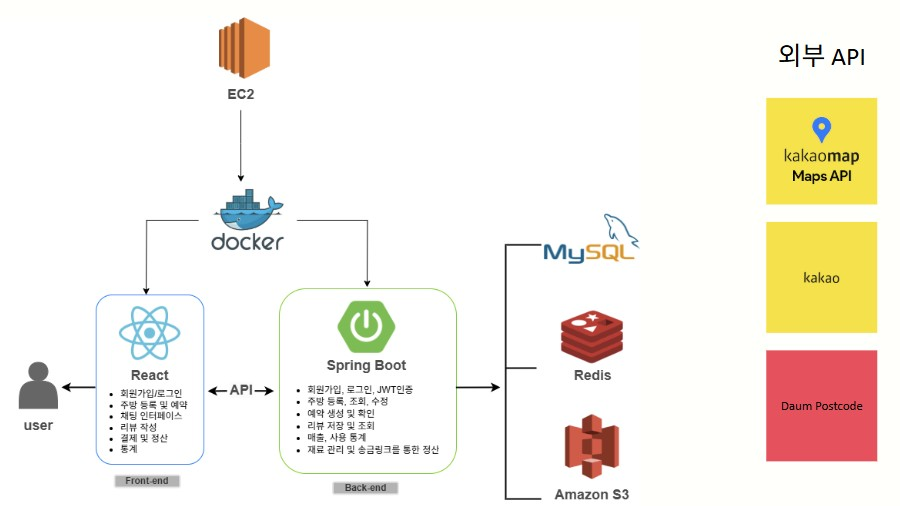

# 🍽️ Anyone can cook! 오직, 공유주방만을 위한 공간대여 서비스

---

## 📌 프로젝트 개요

> EveryKitchen은 공유주방 예약에 특화된 공간 대여 플랫폼으로, 공간 예약뿐만 아니라 설비 정보 제공, 재료 정산 과정을 통합 제공하여 사용자와 호스트 간의 번거로운 사전 협의를 최소화합니다.

---

## ✨ 주요 기능

공유 주방의 특수성이 고려되지 않은 기존 공간대여 플랫폼의 한계를 보완하여 다음과 같은 기능을 중심으로 설계되었습니다:

- 위치 기반 주방 검색 및 필터링
- 실시간 주방 예약
- 주방별 설비·도구·재료 정보 제공
- 재료 사용량 기반 정산 기능
- 호스트 전용 주방 및 매출 관리
- 리뷰 작성 및 평점 시스템

---
## 🖥️ 서비스 화면

### 메인페이지

- 필터 기능으로 지역, 날짜, 인원, 가격, 시설을 설정하여서 원하는 주방을 검색
- 정렬 기능 이용하여 가격, 후기 순 정렬
- 검색란에 주방 이름 입력 시 관련 주방 출력

### 지도 검색

- 위치 정보 동의 시 현재 위치 기준 3km 반경 주방을 마커로 표시
- 주방 목록 클릭 시 해당 주방 위치로 지도 이동
- 마커 클릭 시 상세 주방으로 이동 기능 제공

### 주방 상세 페이지

- 공간, 시설, 재료에 대한 정보를 사용자 예약 편의에 맞도록 제공

### 주방 예약

- 날짜, 시간, 인원 선택 후 예약하기 클릭
- 카카오톡으로 송금 안내 받기
- 예약 내역 확인 (호스트 승인 전 후 예약대기 → 예약완료)

### 재료 정산

- 사용한 재료 내역에 대해서 사용량을 입력하면 단위에 맞춰서 계산
- 사용 금액에 대해서 입금 완료 후 호스트 승인에 따라 (정산대기 → 정산완료)

### 호스트 매출 관리

- 미정산 내역과 월 별 정산 내역 제공

### 호스트 주방 관리

- 주방 등록의 경우 호스트의 입력 편의성과 사용자의 정보 제공을 위해 폼 형식으로 모든 항목에 대하여 필수 입력
- 공간, 설비, 도구, 품목, 재료까지 5단계의 정보를 입력 후 등록

---

## 🛠️ 시스템 아키텍처

EveryKitchen은 React와 Spring Boot 기반으로, AWS EC2 환경에서 Docker로 배포되었습니다.
외부 API와의 연동을 통해 지도, 주소, 인증 기능도 통합 구현하였습니다.

---

## 👩‍💻팀원소개

| 팀원           | 역할     |
|----------------|----------|
| 문민제, 박성철 | Frontend |
| 전진명, 박지선 | Backend  |
